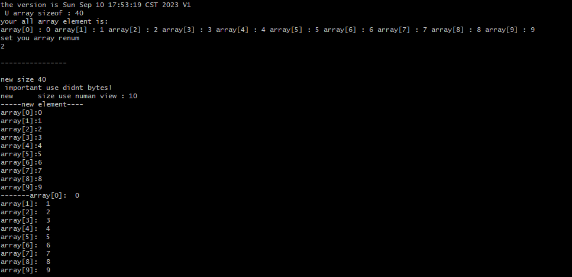

## 在刷co 題目的時候 突然發現一題

>You are given two integer arrays nums1 and nums2, sorted in non-decreasing order, and two integers m and n, representing the number of elements in nums1 and nums2 respectively.

So solution is =>

因為 身為 科技女神的我來說 我就用我喜歡的C來寫 
一定有人說 幹嘛要用C  喜歡的東西 有時沒有理由~ 就像    阿ㄒ一ㄢ 
後來就是 我太久沒寫 幾乎都忘記了....
好巴 講那麼多 開始巴XD

---
首先 為什麼有這支檔案的產生  
其實呢... 就是因為 我對C陣列的疑問  
因為C對 陣列的 
>但 C 語言不會檢查索引是否逾越陣列的邊界
[reference](https://opensourcedoc.com/c-programming/array/)
 

所以 我突然想到 如果我對一個陣列(一開始有數值) 
但是後來我再把 陣列的大小變小 那顯示後如何 

然後 就像我用的code  
然後 後面呈現的是 畫面...

可以看出  就算我把 陣列的大小變小 也沒有意義...
所以得出 如果一開始要把陣列的東西 
做合併的話 需要rewrite  
༼ つ ◕_◕ ༽つ
  

所以我就因為這個 C 的根本問題... 
把題目又丟到腦後了啦....QQ  
好啦 現在時間是
Mon Sep 11 00:03:51 CST 2023
因該繼續去刷題 XD
