# git diff 
我以前就是 草草得用就好      
後來看到一個人寫的文章       
> 會用比

我最近都在  大力的忙...      
不過就寫寫我最近遇到的一個東西XD         

先來看看這個圖片 這是我最近認真寫git 的心得      
(✿◕‿◕✿)
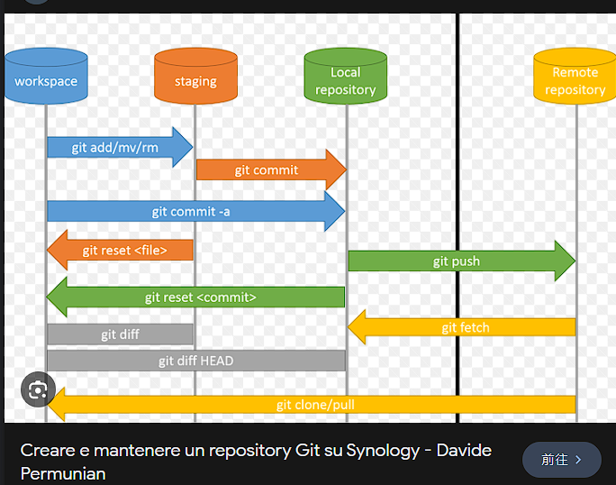
這是我看到別人寫的 我一開始很開心        
想說 我站在巨人的肩膀上(笑) o(\*≧▽≦)ツ┏━┓        

後來當我在寫 git diff 我真的 寫1寫       
發現不對...      
因為我在做 git diff          

有3種
+ git diff --cached
+ git diff
+ git diff HEAD

> 我寫道我都會背了
>> 可見知道我跌的多慘

然後我一開始 看到這個圖 還想說 天啊          
怎麼會這樣呢..       
有問題也         

所以我就改版         
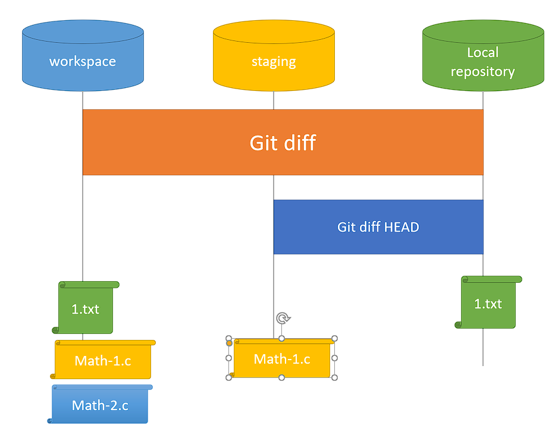
因為我再用各種test       

看到這個圖片 就知道      
我用了 1.txt 先 add => commit        
然後 在new file math-1.c math-2.c        
然後 `git add math-1.c`      

後來就像圖片一樣         
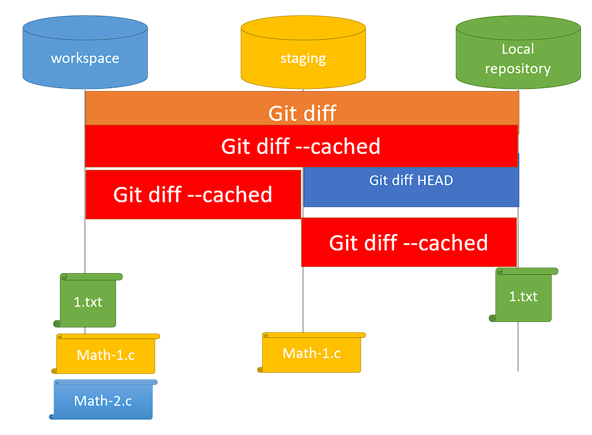
對亞 我做了 兩種 那`diff --cached `      
在哪裡呀..ORZ        
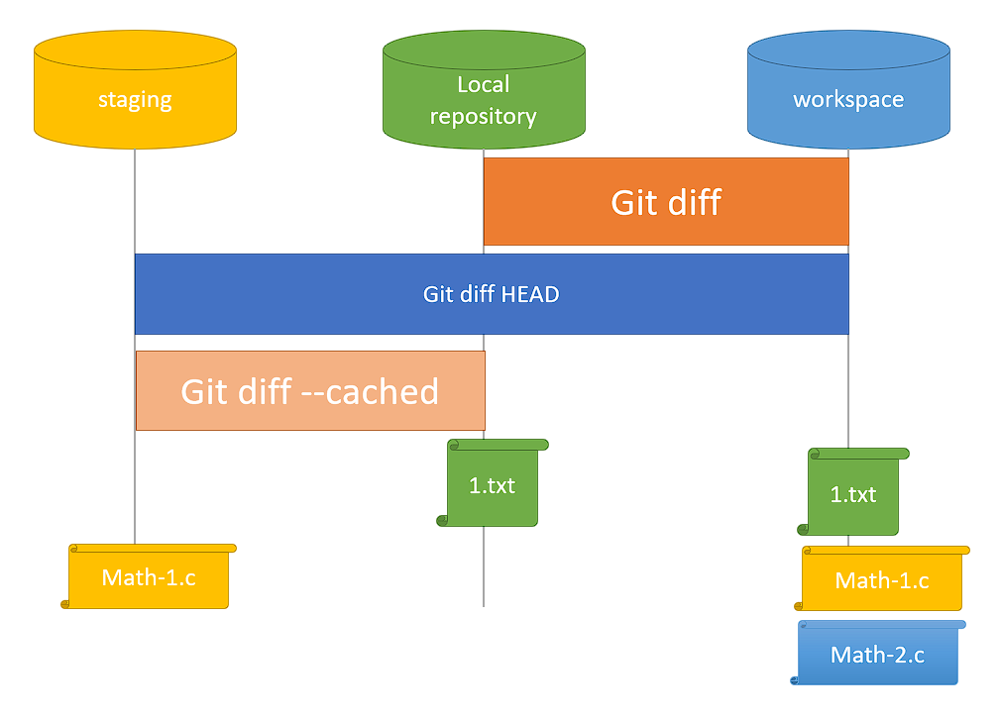

後來呢 我就繼續寫測試...         
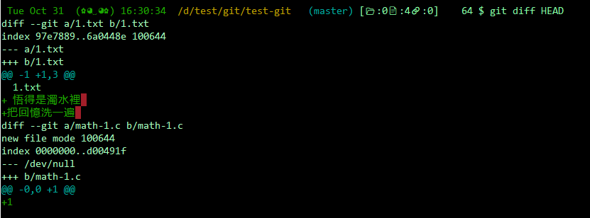
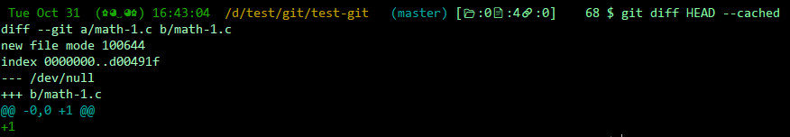
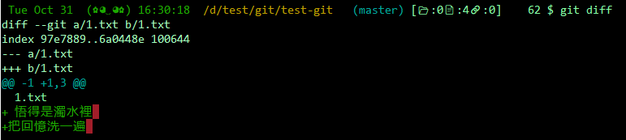

做完後 我就蒙掉了....        
怎麼怪怪的       
對於coding 女神的我來說      
我怎麼會...      
女人的直覺 直接讓我覺得怪怪的        
所以我就把畫一次         

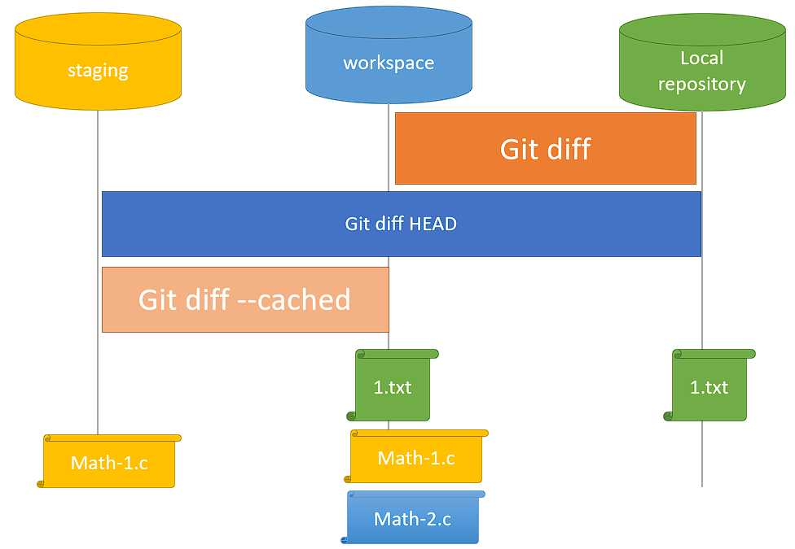
我改了 working directory 在中間      

後來我就看到一個人寫的       
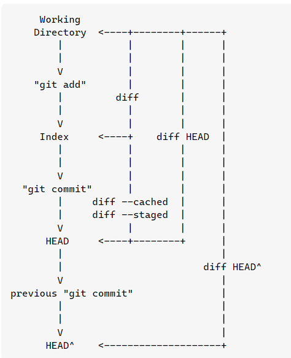
[萬點附上ref](https://stackoverflow.com/questions/3686452/what-are-the-differences-between-these-git-diff-commands)
他是我跌倒的明燈..       
我直接如同 brainstome        
後來我繼續test       
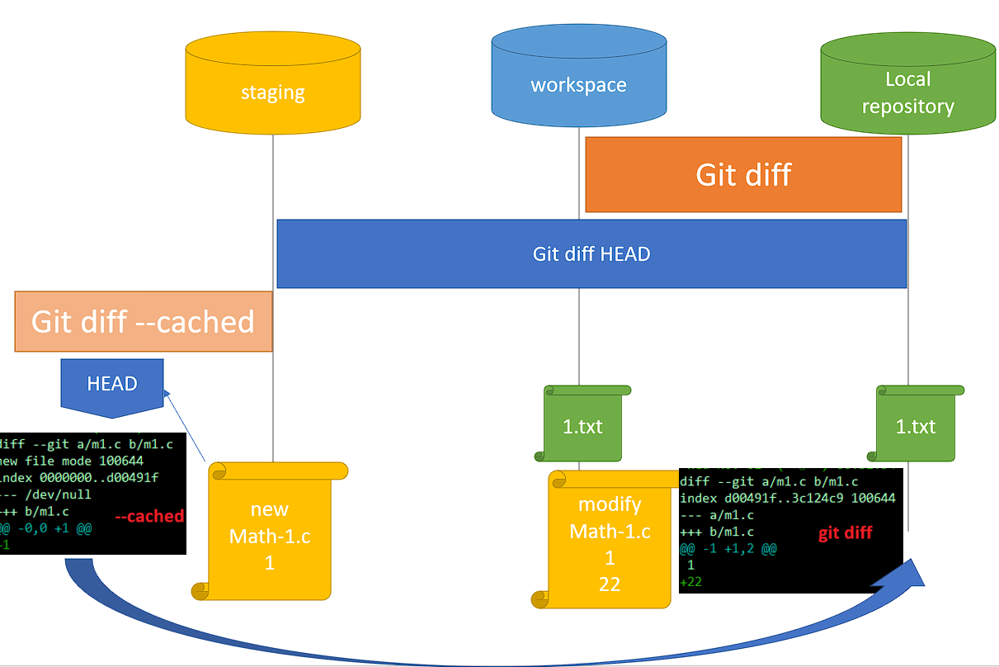
我還發現 
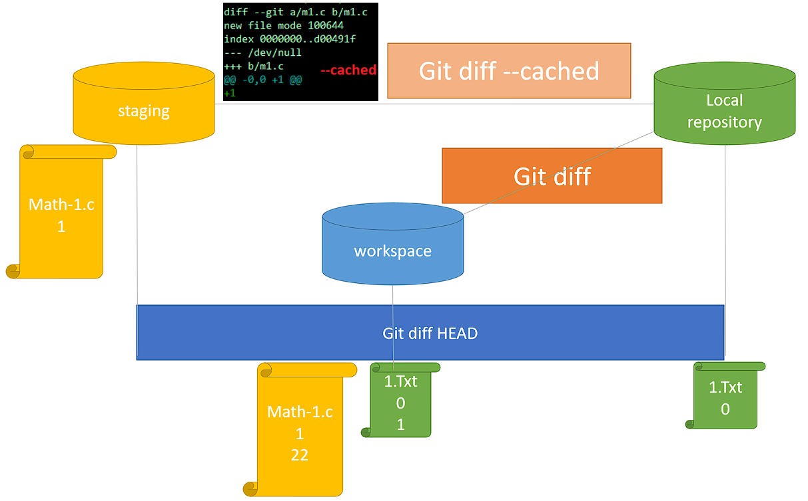
我就想說 `git diff HEAD`         
是因為 他會先比 workspace and staging 在比 respository       
但是我又覺得哪裡怪怪的       
我真的被自己打敗...      
明明用過diff 卻還是被自己的          
固執化認知錯誤帶錯...        
diff的比較明明是2種compare..         

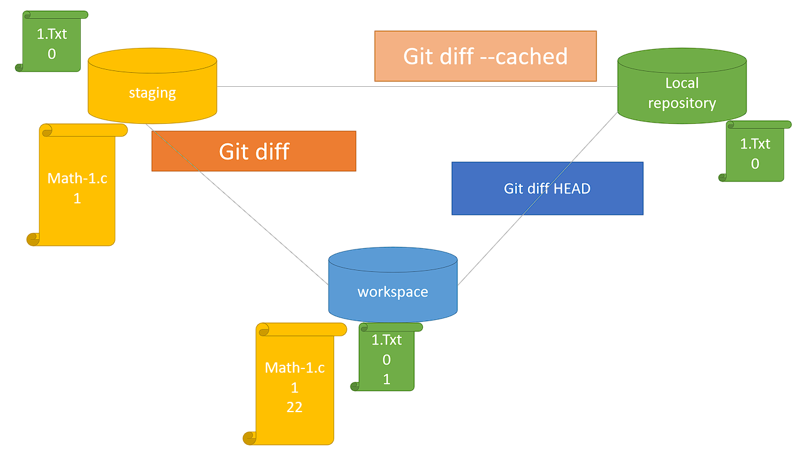
所以就改版成這樣了!! finaly....      
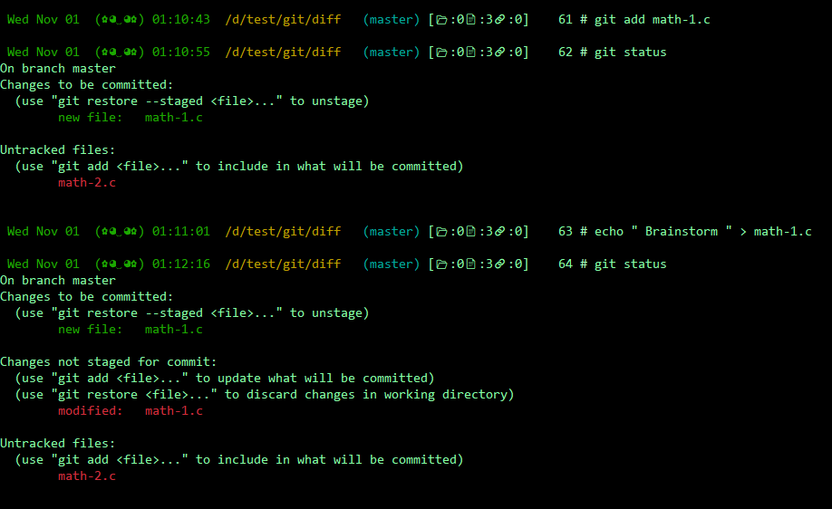
因為這個圖片 才引發一切...       
我瘋了...        

###### Fri Nov  3 00:09:01 CST 2023
###### Fri Nov  3 00:30:53 CST 2023
